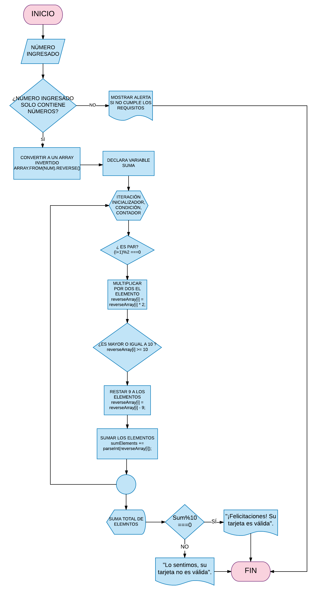

# Tarjeta de Crédito Válida

## Objetivo
Crear una web que solicite el número de una tarjeta de crédito y confirme su validez, basándose en el algoritmo de Luhn.

## Diagrama de Flujo
El siguiente diagrama ilustra las operaciones y la secuencia en la que se deben realizar para llevar a cabo la solución del producto final.

## Pseudocódigo
Representamos la solución de uns algoritmo de manera detallada y lo más parecida posible al lenguaje que posteriormente se utilizará para la codificación del mismo.
~~~js
Proceso TarjetadeCreditoValida
Ingreso de datos por medio de un prompt.
creamos una función isvalidcard con las siguientes condiciones:
si cardNumber === undefined || cardNumber === null
    alert('¡Hasta pronto!')

 se creo una función previa para validar si contiene letras
 si (containletters(cardNumber)
    alert('Número de tarjeta no puede contener letras.');

se creo una validación para verificar si se ingreso un campo vacio
	si (cardNumber.length === 0)
    alert('No puede ingresar un dato vacio.');

convertirmos la cadena en un array invertido
   Array.from(cardNumber).reverse();
creamos una variable que almacena
    var sumElements = 0;
mediante un for hacemos el recorrido
  for (var i = 0; i < reverseArray.length; i++)
verificamos que el número sea par
    if ((i + 1) % 2 === 0) {      
 Se coloca 1 porque el indice empieza en 0 y %2 para ver si es par
      reverseArray[i] = reverseArray[i] * 2;
			Se multiplica por 2 los números pares
      if (reverseArray[i] >= 10) {
 Si la múltiplicación es >= 10, restar -9 para que te de la suma de los dos digitos.
        reverseArray[i] = reverseArray[i] - 9;
  sumElements += parseInt(reverseArray[i]);
	Convertir cadena en entero
  devuelve sumElements % 10 === 0
    ? alert('¡Felicitaciones! Su tarjeta es válida')
    : alert('Lo sentimos, su tarjeta no es válida.');
función creada para validar que no tenga letras
var containletters = function(text) {
  text = text.toLowerCase();
  for (var i = 0; i < text.length; i++) {
    if (text.charAt(i) >= 'a' && text.charAt(i) <= 'z') {
      return true;
FinProceso
~~~
